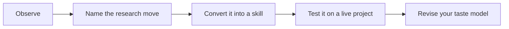

# 00 - Start Here

This opening chapter explains how to read the repository as a book rather than as a directory. Research taste is the ability to make disciplined choices before the evidence is obvious: which question deserves attention, which mechanism is worth isolating, which data limitation is fatal, and which claim would overreach. The rest of the book only works if this idea is clear.

A beginner should read this chapter slowly. The point is not to memorize definitions, but to learn a new way of looking at papers. Every paper becomes a trail of decisions. The strongest readers ask why those decisions were made and what transferable skill those decisions reveal.

## How This Chapter Should Be Read

Read the chapter in paragraphs, not as a checklist. The headings are navigation aids, but the substance is the judgment behind them. When you finish a page, you should be able to say: this is the research choice being discussed, this is what good taste looks like, this is what bad taste looks like, and this is how I would apply the lesson to one of my own projects.

## Working Rule

A taste principle is only useful when it changes a decision. If a page gives you a pleasing phrase but no change in question, design, measure, mechanism, writing, or revision strategy, keep reading until you can turn the idea into an action.
