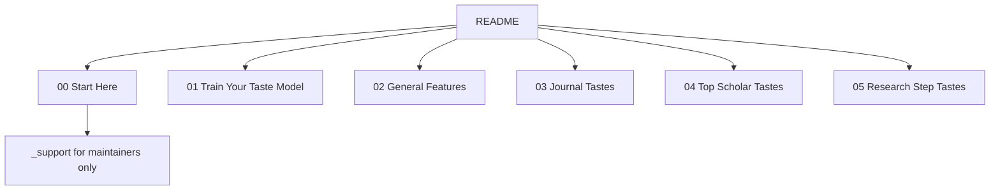

# Repository Structure

The public repository is organized as a five-chapter book. Readers should only need the folders numbered `00` through `05`. Everything else that supports the site, scripts, templates, old indexes, data, and checks has been folded into `00-start-here/_support/` so the top-level GitHub view stays readable.

The numbered chapters are the reading path. Chapter `00` introduces the method and vocabulary. Chapter `01` teaches the taste-training loop. Chapter `02` explains what good and bad research taste look like across core dimensions. Chapter `03` compares journal taste environments. Chapter `04` turns top scholars into portable research moves. Chapter `05` applies the whole system to the life cycle of a research project.

Maintainers can use `_support` when they need scripts, templates, hidden data, or archival material. Readers should ignore it.
