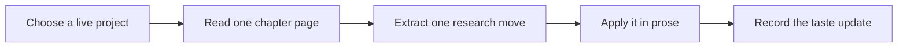

# How To Use This Repo

Use this repository as a reading course, not as a file cabinet. Start with the problem you are actually working on: a paper idea, a theory, a measure, an identification strategy, a confusing literature, or a weak introduction. Then read the chapter that puts pressure on that problem. The repo is useful only when it changes a research decision.

A good first pass takes one week. Read the opening chapter, then choose one page from general taste, one page from journal taste, one scholar page, and one research-step page. Write a short memo after each page explaining what it teaches you to do. At the end of the week, revise one project paragraph using the strongest lesson.

If you are maintaining the repository, keep the public surface book-like. New reader-facing pages belong inside chapters `00` through `05`. Maintenance material belongs under `_support`, where readers do not need to see it.
