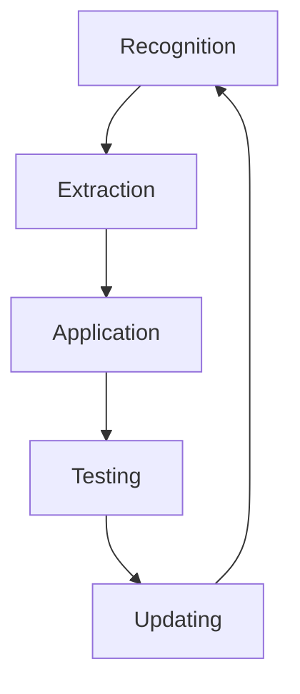

# Research Taste Roadmap

Research taste develops in stages. The first stage is recognition: learning to see why one question has force and another merely sounds clever. At this stage, read slowly and ask what decision the author made. Do not rush to summarize the paper.

The second stage is extraction. A paper becomes useful when you can name the research move inside it. The move might be a measurement trick, a clean comparison, a model simplification, a way to motivate a setting, or a boundary condition that prevents overclaiming.

The third stage is application. A taste principle is not yours until you try to use it on a live project. The first application will often feel awkward. That is useful: it shows which parts of your project are still vague.

The fourth stage is testing. You test the skill against alternative mechanisms, data constraints, journal standards, and skeptical readers. The question is not whether the skill sounds impressive. The question is whether it improves the project.

The final stage is updating. Write down what changed in your judgment. A taste model that never records updates becomes a set of preferences. A taste model that records updates becomes a research instrument.

