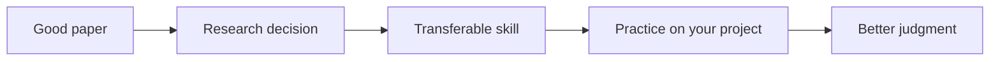

# What Is Research Taste?

Research taste is the judgment behind good research choices. It is not the same as intelligence, technical skill, or field knowledge, although it uses all three. A researcher with good taste can sense when a question is important rather than merely clever, when a mechanism is doing work rather than decorating the paper, when a measure captures the concept rather than the noise, and when a result changes what the field should believe.

In economics and finance, taste matters because technical correctness is not enough. A project can have clean code, competent econometrics, and polished writing while still failing as research. The question may be small. The design may answer something adjacent to the claim. The theory may be too flexible to discipline interpretation. The results may be precise but unimportant. Taste is the ability to notice these failures early enough to revise.

This repo treats taste as trainable. You train it by reading excellent work for decisions, not only for results. You ask why the paper begins where it begins, why the design is credible, why the model is simple or complex, why the author claims only so much, and why the contribution travels beyond the setting. Then you turn the answer into a skill and practice it on your own work.

