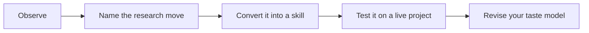

# 01 - Train Your Taste Model

This chapter turns taste from an abstract virtue into a repeatable practice loop. You read a paper, identify the research move, translate it into a skill, test the skill on your own project, and record whether it improved the project. Over time, this loop becomes a personal taste model.

The danger in research training is passive admiration. It is easy to say that a paper is elegant, clever, or important. It is harder to state what the paper teaches you to do on Monday morning. This chapter is designed to force that translation.

## How This Chapter Should Be Read

Read the chapter in paragraphs, not as a checklist. The headings are navigation aids, but the substance is the judgment behind them. When you finish a page, you should be able to say: this is the research choice being discussed, this is what good taste looks like, this is what bad taste looks like, and this is how I would apply the lesson to one of my own projects.

## Working Rule

A taste principle is only useful when it changes a decision. If a page gives you a pleasing phrase but no change in question, design, measure, mechanism, writing, or revision strategy, keep reading until you can turn the idea into an action.
