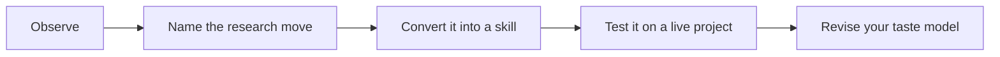

# 01 - Train Your Taste Model

This chapter turns taste from an abstract virtue into a repeatable practice loop. You read a paper, identify the research move, translate it into a skill, test the skill on your own project, and record whether it improved the project. Over time, this loop becomes a personal taste model: not a list of favorite topics, but a set of practiced judgment routines.

The danger in research training is passive admiration. It is easy to say that a paper is elegant, clever, or important. It is harder to state what the paper teaches you to do on Monday morning. Mature research skill starts at exactly that point. A good card tells you when to use the skill, what move to make, what evidence anchors it, how to practice it, how to get feedback, and where the move fails.

## The Maturity Standard

The main standard for this chapter is explained in [Mature Skill Standard](mature-skill-standard.md). Read that page before treating any scholar page as finished. The standard borrows from learning research on expertise and deliberate practice: skills need component moves, integration, feedback, and transfer. In this repo, that means a skill must do work on a live research problem. If it only sounds wise, it is still immature.

A mature skill usually begins with a trigger. The trigger tells you when the skill is relevant. It then names the research move in operational language: make a comparison group credible, turn a setting into a mechanism, build a measure that reveals an otherwise hidden object, use a model to isolate a force, or write an introduction that moves from puzzle to contribution. The skill then names a feedback signal. You should know whether the project became sharper after using it.

The last part is the boundary. This is where taste becomes disciplined. The same move that produces a strong paper in one setting can produce overclaiming in another. Natural-experiment taste fails when the comparison is weak. Big-question taste fails when the evidence is too thin. Elegant-theory taste fails when the model does not change what the reader believes. A mature skill tells you not only what to imitate, but when to stop imitating.

## How This Chapter Should Be Read

Read the chapter in paragraphs, not as a checklist. The headings are navigation aids, but the substance is the judgment behind them. When you finish a page, you should be able to say: this is the research choice being discussed, this is what good taste looks like, this is what bad taste looks like, and this is how I would apply the lesson to one of my own projects.

## Working Rule

A taste principle is only useful when it changes a decision. If a page gives you a pleasing phrase but no change in question, design, measure, mechanism, writing, or revision strategy, keep reading until you can turn the idea into an action. If a skill does change the decision, write down the before and after version. That small record is how the taste model stops being an opinion and becomes trained judgment.

## Chapter Path

Start with [what a taste model is](what-is-a-taste-model.md), then read the [mature skill standard](mature-skill-standard.md). After that, use the [paper-to-skill-to-theory loop](paper-to-skill-to-theory-loop.md) and the [scholar taste extraction method](how-to-extract-scholar-taste-from-papers.md) on one paper you know well. The exercises, labs, scorecard, and taste log are there to make the loop repeatable rather than inspirational.
