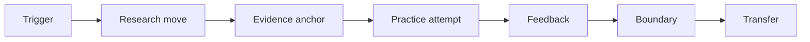

# Mature Skill Standard

A mature research skill is not a topic, a personality trait, or a sentence of admiration for a famous scholar. It is a small piece of judgment that can be used on a live project. The standard in this repository is therefore stricter than "this scholar studies institutions" or "this paper is elegant." A skill is mature only when it tells the reader when to use it, what move to make, what evidence would count as feedback, and where imitation becomes bad taste.

This standard follows a simple lesson from research on expertise and learning. Experts do not merely remember more facts; they organize knowledge around deep structures and know when a pattern is relevant. Skill also improves through practice with a specific goal, feedback, and revision. For research training, that means a skill card should behave like a disciplined exercise. It should change a question, a model, a measurement choice, an identification argument, a contribution claim, or a paragraph in the introduction.



The first part of a mature skill is the trigger. The card should say what kind of project problem calls for the skill. A design skill might be triggered when a project has an interesting policy shock but no comparison group. A theory skill might be triggered when a project has a plausible story but no agent, friction, or prediction. A writing skill might be triggered when the introduction names a topic but not a puzzle. Without a trigger, the skill cannot be used at the right time.

The second part is the research move. The card should describe the intellectual action, not the scholar's field. "Study labor markets" is not a move. "Use a real-world rule or discontinuity to make a causal comparison credible" is a move. "Study asset pricing" is not a move. "Translate a return pattern into a claim about discount rates, cash-flow expectations, risk, or mispricing, then ask which interpretation survives the evidence" is a move.

The third part is the evidence anchor. A mature skill should be tied to papers, author pages, journal articles, lecture notes, Nobel materials, or uploaded PDFs. The evidence anchor does not need to turn the page into a literature review, but it must prevent fantasy. If the page cannot point to where the scholar repeatedly performs the move, the skill should remain provisional.

The fourth part is practice with feedback. A user should be able to paste the skill into a project memo and produce a before-and-after change. The useful feedback is not "this sounds smart." The useful feedback is whether the project now has a sharper puzzle, a cleaner mechanism, a more credible test, a better measure, a narrower claim, or a more convincing introduction.

The fifth part is the boundary. Every skill has a failure mode. Natural-experiment taste becomes bad taste when the comparison is weak but the language is strong. Big-question taste becomes bad taste when the proxy is too thin for the claim. Elegant-theory taste becomes bad taste when the model decorates the paper without changing a prediction. Finance-factor taste becomes bad taste when a return pattern is treated as a mechanism before alternatives are ruled out.

The final part is transfer. A skill is not mature until it can travel to a nearby project without copying the original topic. The right test is relative use: take the scholar's move, apply it to your own setting, and explain what changes. If nothing changes, the card is still a note. If the project gets a better decision rule, the card has become a skill.

## Depth Standard

A one-line skill is only an index label. It is not a finished skill. A finished skill should read more like a reusable research instruction than a flashcard. It should normally include a name, description, scope of use, trigger, sequence of moves, diagnostics, anti-patterns, practice prompt, and boundary conditions. It should be long enough that a researcher can paste the skill into a project note and know what to do next without asking for a second explanation.

The target length is not fixed, but the card should usually be several substantial paragraphs. A card that says only "use prices as evidence" is too short. A mature version explains when prices are informative, what benchmark is needed, which interpretations compete, what extra evidence separates risk from beliefs or frictions, what claims the design can support, and when price evidence becomes overclaiming. Brief labels are useful in tables, maps, and indexes, but the linked skill text must carry the real instruction.

The style should be continuous prose by default. Bullets are allowed for diagnostics or practice prompts, but the core skill should read like a short chapter: what the skill is for, why it matters, how it works, how to diagnose failure, and how to apply it to a live project.

## Copy-Paste Maturity Test

Use this test before treating any card in the repo as finished.

```text
Skill:
Project where I want to use it:
Trigger: this skill is relevant because my project currently has...
Research move: I will change the project by...
Evidence anchor: the scholar or paper teaches this move through...
Feedback: I will know it worked if...
Boundary: I should stop using the skill if...
Transfer sentence: after applying the skill, my project is sharper because...
```

## External Learning Sources Behind The Standard

The standard is informed by four public learning and research-writing sources: [Ericsson, Krampe, and Tesch-Romer on deliberate practice and expert performance](https://doi.org/10.1037/0033-295X.100.3.363); [Carnegie Mellon's Eberly Center on mastery as component skills plus integration and knowing when to apply them](https://www.cmu.edu/teaching/principles/learning.html); the National Academies' [*How People Learn*](https://nap.nationalacademies.org/catalog/9853/how-people-learn-brain-mind-experience-and-school-expanded-edition) on experts, prior knowledge, and learning; and Booth, Colomb, Williams, Bizup, and Fitzgerald's [*The Craft of Research*](https://press.uchicago.edu/ucp/books/book/chicago/C/bo215874008.html) on research as a process of meaningful inquiry and communication. These sources are not finance or economics taste manuals, but they explain why finished skill cards need triggers, procedures, feedback, and transfer rather than labels.
