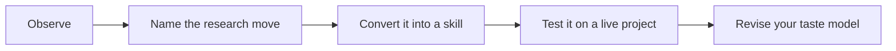

# 02 - General Features Of Good Research Taste

This chapter describes the recurring features of strong research judgment across economics and finance. Good taste is visible in question choice, theoretical discipline, data construction, measurement, identification, mechanism testing, contribution framing, and writing. Bad taste is also visible: clever questions with no audience, precise methods with weak concepts, and polished introductions that hide an empty contribution.

Read these pages as diagnostic lenses. No single project needs to be perfect on every dimension, but every serious project must know which dimensions carry the argument and which dimensions remain fragile.

## How This Chapter Should Be Read

Read the chapter in paragraphs, not as a checklist. The headings are navigation aids, but the substance is the judgment behind them. When you finish a page, you should be able to say: this is the research choice being discussed, this is what good taste looks like, this is what bad taste looks like, and this is how I would apply the lesson to one of my own projects.

## Working Rule

A taste principle is only useful when it changes a decision. If a page gives you a pleasing phrase but no change in question, design, measure, mechanism, writing, or revision strategy, keep reading until you can turn the idea into an action.
