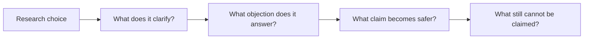

# Good Data Taste

This page is a short chapter on data. In economics and finance, good data taste means that the researcher makes a choice that improves the argument rather than merely decorating it. The choice should make the project more important, more credible, easier to test, or easier to understand. If it does none of those things, it is probably style rather than taste.

Good data taste begins with pressure. A researcher should be able to say what would go wrong if this dimension were weak. A question without importance produces a forgettable paper. A measure without conceptual discipline produces false precision. A mechanism without a real test becomes storytelling. A contribution without audience discipline becomes self-description. The chapter asks you to notice that pressure before you polish the prose.

## What Good Taste Looks Like

Good taste in this dimension connects the local choice to the paper's larger learning goal. It makes the reader understand why the decision matters and what would be lost without it. In economics, that usually means sharper reasoning about behavior, institutions, welfare, markets, or causal mechanisms. In finance, it often means sharper reasoning about prices, risk, beliefs, frictions, constraints, intermediaries, firms, or investors.

## What Bad Taste Looks Like

Bad taste appears when the dimension is handled mechanically. A project can have more data, more robustness, more model notation, or more institutional detail without becoming better. The warning sign is a section that looks responsible but does not change what the reader learns. When that happens, the researcher should cut, simplify, or rebuild the choice around the real skeptical objection.

## Practice Paragraph

Take one current research idea and write three paragraphs. The first paragraph should describe how this dimension currently works in the project. The second should name the strongest weakness or objection. The third should make one revision that would improve the project's research taste. Do not write bullets; force yourself to explain the judgment in prose.
