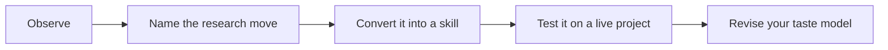

# 03 - Journal Research Tastes

This chapter treats journals as taste environments. A journal is not just a ranking. It is a community with expectations about question size, evidence, theory, mechanism, contribution, and writing. Reading journal taste well helps a researcher understand why one paper travels widely while another, technically competent paper, feels too narrow.

The purpose is not to game journals. The purpose is to learn audience discipline. A strong paper must know who should care, what that audience already believes, what would change their mind, and why the paper belongs in that conversation.

## How This Chapter Should Be Read

Read the chapter in paragraphs, not as a checklist. The headings are navigation aids, but the substance is the judgment behind them. When you finish a page, you should be able to say: this is the research choice being discussed, this is what good taste looks like, this is what bad taste looks like, and this is how I would apply the lesson to one of my own projects.

## Working Rule

A taste principle is only useful when it changes a decision. If a page gives you a pleasing phrase but no change in question, design, measure, mechanism, writing, or revision strategy, keep reading until you can turn the idea into an action.
