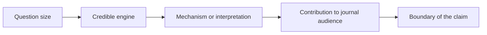

# AER Research Taste

This page reads AER as a research-taste environment. A journal's taste is not a secret formula; it is the pattern of questions, evidence, theory, mechanisms, and contribution claims that its audience tends to find worth serious attention. The purpose of this page is to help a researcher ask whether a project belongs in that conversation.

A strong fit usually begins with audience. The paper must make a reader understand why the question matters beyond a narrow setting. It then needs a credible engine: a design, model, measurement strategy, or institutional argument strong enough to carry the claim. Finally, it needs writing that makes the contribution legible early without pretending the paper proves more than it can.

## Reading The Journal For Taste

Read accepted papers by asking what had to be true for the paper to feel publishable here. Was the question unusually broad? Was the identification unusually transparent? Was the theory unusually clean? Was the setting narrow but the lesson general? The answer should become a paragraph about judgment, not a list of paper titles.

## Fit Diagnosis

A paper is weak for this journal when the contribution is incremental, the audience is too local, the mechanism is vague, or the evidence is not strong enough for the claim. A paper becomes more plausible when the introduction can state the problem, the engine, the contribution, and the boundary in a way that a broad reader understands before the technical sections begin.

## Revision Prompt

Write a one-page submission-fit memo. The first paragraph should explain why this journal's audience should care. The second should describe the engine of the paper. The third should state the strongest objection. The final paragraph should say what claim the paper can honestly make and what claim it should avoid.
