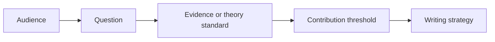

# Top Finance Journals

This section should be read as a comparison chapter. The point is not that one journal has taste and another does not. The point is that each journal asks a different version of the same hard question: why should this audience believe that this paper changes something important?

A useful way to read the pages is to compare the burden of proof. Some journals demand broad economic importance. Some demand unusually clean theory. Some reward empirical designs that change what the field believes about a mechanism. Some are more willing to accept specialized settings when the lesson travels. The skill is to diagnose that burden before writing the paper as if every audience were the same.

Read one journal page, then immediately compare it with another. The contrast is where taste becomes visible.
