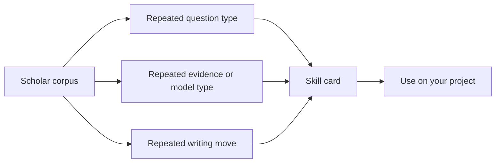

# 04 - Top Scholar Research Tastes

This chapter turns top scholars into a reading laboratory. The purpose is not admiration. The purpose is extraction. A scholar's body of work shows repeated choices about what counts as an important question, what kind of mechanism deserves attention, what evidence can carry the argument, and how far the conclusion should travel. Those choices can be translated into research skills.

A serious reader should not copy a scholar's topic. Copying topics usually produces derivative work. The useful move is to copy a pattern of judgment. Acemoglu teaches how to connect large institutional questions to mechanisms and evidence. Card and Angrist teach how design clarity can discipline causal claims. Goldin teaches how historical measurement can reshape economic questions. Fama, French, Cochrane, Shiller, Brunnermeier, and others teach different ways to make finance arguments travel from prices and frictions to broader beliefs about markets.

## How The Pages Were Checked

The current pages use representative paper anchors and well-established public research profiles to form reviewed draft skill cards. They should still be upgraded over time with exact paper links and direct quotations where appropriate. The check performed here is conceptual rather than bibliographic: each skill must be plausibly tied to repeated work, transferable beyond one paper, and bounded so the reader knows when imitation would become bad taste.

A skill on these pages is considered mature only if it passes the standard from [Chapter 01](../01-train-your-taste-model/mature-skill-standard.md). It must identify a trigger, a research move, an evidence anchor, a practice attempt, a feedback signal, a boundary, and a transfer sentence. This matters because the purpose is relative use. A reader should not ask, "How do I become Acemoglu, Card, Fama, or Shiller?" The better question is, "Which part of this scholar's judgment can improve the project I am actually writing?"

## How To Read This Chapter

Choose one economist and one finance scholar. Read the one-sentence taste, then read the skill cards as paragraphs about judgment. Ask three questions: what does this scholar make important, what kind of evidence or model does the scholar trust, and what claim would this scholar refuse to overstate? Then apply one skill to your own project and write the before and after version. The answers are more valuable than the scholar label.

## Scholar Groups

The economist pages emphasize institutions, labor, development, industrial organization, public finance, history, econometrics, and theory. The finance pages emphasize asset pricing, corporate finance, intermediation, behavioral finance, macro-finance, banking, risk, and market design. Read across the boundary; many of the best research skills travel better than field labels suggest.

- [Economists](economists/)
- [Finance scholars](finance-scholars/)
- [Nobel laureates](nobel-laureates/)
