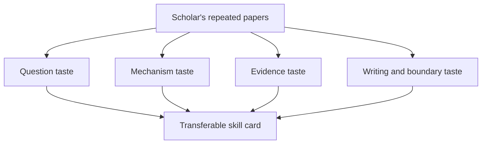

# Economists

This chapter reads economists as teachers of research judgment. Each scholar page is a compact study of repeated taste: the questions the scholar makes important, the mechanisms or designs that carry the argument, the kind of evidence that receives trust, and the boundaries that keep the contribution honest.

The pages should not be read as biography. They are closer to marginal notes from reading papers. A good scholar page lets you borrow a research move without copying the topic. When the page works, you can close it and immediately revise your own project with a sharper question, cleaner mechanism, better test, or more disciplined introduction.

## Reading Guide

Start with one scholar whose field is close to your project and one whose field is distant. The nearby scholar will teach practical moves; the distant scholar will reveal whether the move is truly general. For every page, ask what the scholar repeatedly refuses to leave vague. That refusal is often the center of the taste.

## Scholar Map

| Scholar | Dominant Skill Signals | Confidence |
|---|---|---|
| [Abhijit Banerjee](abhijit-banerjee/) | Use simple behavioral models to explain development puzzles, Treat policy variation as a way to learn mechanisms | high |
| [Bengt Holmström](bengt-holmstrom/) | Model incentives under hidden action and information, Use contract design to explain organizations and finance | medium |
| [Claudia Goldin](claudia-goldin/) | Use history to explain long-run labor market change, Turn descriptive patterns into deep institutional questions | high |
| [Daron Acemoglu](daron-acemoglu/) | Model institutions as causal systems, Turn historical variation into modern causal evidence | high |
| [David Card](david-card/) | Use natural experiments to challenge conventional wisdom, Find comparison groups in real-world labor markets | high |
| [Edward Glaeser](edward-glaeser/) | Treat cities as laboratories for economic mechanisms, Use simple theory to organize spatial facts | high |
| [Emmanuel Saez](emmanuel-saez/) | Use tax data to measure inequality and behavioral responses, Translate sufficient statistics into policy-relevant formulas | high |
| [Esther Duflo](esther-duflo/) | Use field experiments as disciplined learning systems, Turn policy questions into testable mechanisms | high |
| [Gabriel Zucman](gabriel-zucman/) | Measure hidden wealth using accounting inconsistencies, Turn macro-financial data gaps into research questions | high |
| [Guido Imbens](guido-imbens/) | Formalize causal inference without losing applied intuition, Clarify what an estimand means before estimating it | high |
| [James Heckman](james-heckman/) | Treat selection as a central research object, Link econometric structure to human capital mechanisms | medium |
| [Jean Tirole](jean-tirole/) | Build models around incentives, information, and strategic constraints, Use theory to organize regulation and market design | medium |
| [Joel Mokyr](joel-mokyr/) | Use economic history to explain technological progress, Treat culture and ideas as mechanisms in growth | medium |
| [Joseph Stiglitz](joseph-stiglitz/) | Treat information imperfections as first-order economic forces, Use theory to challenge benchmark market-efficiency claims | medium |
| [Joshua Angrist](joshua-angrist/) | Turn messy policy variation into credible causal designs, Explain identification in plain language | high |
| [Matthew Gentzkow](matthew-gentzkow/) | Measure information, media, and persuasion from text and behavior, Use structural and reduced-form tools to study communication markets | high |
| [Michael Kremer](michael-kremer/) | Design experiments around practical policy bottlenecks, Use randomized evaluation to test scalable interventions | high |
| [Nicholas Bloom](nicholas-bloom/) | Measure management as an economic variable, Use surveys and experiments to study firms from the inside | high |
| [Oliver Hart](oliver-hart/) | Use incomplete contracts to explain firm boundaries, Turn governance problems into allocation-of-control problems | medium |
| [Paul Krugman](paul-krugman/) | Build simple models that change how a field sees a problem, Use increasing returns and geography to explain trade patterns | medium |
| [Peter Howitt](peter-howitt/) | Use dynamic models to explain innovation-driven growth, Treat disruption as an endogenous part of progress | medium |
| [Philippe Aghion](philippe-aghion/) | Model growth as creative destruction, Link innovation incentives to competition and institutions | medium |
| [Raj Chetty](raj-chetty/) | Use administrative data to map opportunity at scale, Turn granular empirical facts into policy-relevant design | high |
| [Sendhil Mullainathan](sendhil-mullainathan/) | Turn behavioral anomalies into research programs, Use prediction problems to reveal hidden structure | high |
| [Susan Athey](susan-athey/) | Use machine learning to improve causal and policy analysis, Translate platform and market design problems into empirical questions | high |
| [Thomas Piketty](thomas-piketty/) | Build long-run data to reopen old questions, Turn distributional history into macroeconomic evidence | high |
