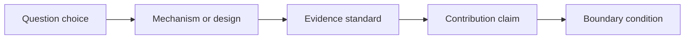

# Daron Acemoglu

Daron Acemoglu is read here as a source of research judgment in economics, not as a topic list. The question is what a researcher can learn from the repeated shape of the work: what kinds of puzzles become important, what mechanisms or designs carry the argument, what evidence is treated as persuasive, and how the paper keeps its contribution within honest boundaries.

The dominant taste signal on this page is visible in the following skills: Model institutions as causal systems, Turn historical variation into modern causal evidence, Combine big questions with tractable empirical proxies, Use political economy mechanisms to explain economic outcomes. Read them as a connected chapter. Together they describe how to move from an interesting setting to a disciplined research claim.

## Evidence Base

The page is built from representative paper anchors and public scholarly reputation, then translated into portable skills. The anchors are not decorative. They are a check against fantasy: if a skill cannot be seen across the papers, it should be downgraded or removed. The Colonial Origins of Comparative Development Institutions as a Fundamental Cause of Long-Run Growth The Network Origins of Aggregate Fluctuations

| Evidence Anchor | What To Check |
|---|---|
| The Colonial Origins of Comparative Development | Use this paper to check whether the skill appears in question choice, mechanism, evidence, or framing. |
| Institutions as a Fundamental Cause of Long-Run Growth | Use this paper to check whether the skill appears in question choice, mechanism, evidence, or framing. |
| The Network Origins of Aggregate Fluctuations | Use this paper to check whether the skill appears in question choice, mechanism, evidence, or framing. |

## Reading The Taste

When reading Daron Acemoglu, focus first on the opening move. Ask how the paper convinces the reader that the question matters. Then look for the engine of the paper: the model, design, data construction, comparison, historical fact, market friction, institutional detail, or mechanism that does the real work. Finally, study the boundary. The strongest papers usually know what they have not proved.

## Skill: Model institutions as causal systems

Use this skill when the project needs a credible source of learning rather than a persuasive story alone. The trigger should be visible before the skill is applied. If the project only shares the scholar's topic, keep reading; if it shares the same kind of research problem, the skill is relevant.

The research move is to model institutions as causal systems in a way that changes the project's decision rule. Read the evidence anchors above and ask what the scholar makes precise: the question, the mechanism or design, the evidence standard, and the boundary of the claim. Your project version should name those pieces before it borrows the move.

Practice the skill in one page. First, write the situation in which you would use "Model institutions as causal systems". Second, state the mechanism, comparison, measure, or benchmark in one sentence. Third, name the closest alternative explanation. Fourth, describe the evidence that would change a skeptical reader's mind. Fifth, write the narrowest honest contribution claim.

Feedback should be concrete. The skill is working if the before-and-after note shows a sharper question, cleaner model, better measure, more credible test, or more disciplined introduction. The skill is still immature if it only produces topic words or admiration for the scholar.

The boundary is part of the taste. This becomes bad taste when the comparison does not support the causal language, or the alternative explanation is named but not taken seriously. A strong use of the skill should make the project more ambitious and more honest at the same time.

A useful self-review prompt is: "Apply the skill 'Model institutions as causal systems' to my project. Identify the trigger, the research move, the evidence anchor, the closest alternative explanation, the feedback signal, the failure mode, and the transfer sentence."

## Skill: Turn historical variation into modern causal evidence

Use this skill when the project needs a credible source of learning rather than a persuasive story alone. The trigger should be visible before the skill is applied. If the project only shares the scholar's topic, keep reading; if it shares the same kind of research problem, the skill is relevant.

The research move is to turn historical variation into modern causal evidence in a way that changes the project's decision rule. Read the evidence anchors above and ask what the scholar makes precise: the question, the mechanism or design, the evidence standard, and the boundary of the claim. Your project version should name those pieces before it borrows the move.

Practice the skill in one page. First, write the situation in which you would use "Turn historical variation into modern causal evidence". Second, state the mechanism, comparison, measure, or benchmark in one sentence. Third, name the closest alternative explanation. Fourth, describe the evidence that would change a skeptical reader's mind. Fifth, write the narrowest honest contribution claim.

Feedback should be concrete. The skill is working if the before-and-after note shows a sharper question, cleaner model, better measure, more credible test, or more disciplined introduction. The skill is still immature if it only produces topic words or admiration for the scholar.

The boundary is part of the taste. This becomes bad taste when the comparison does not support the causal language, or the alternative explanation is named but not taken seriously. A strong use of the skill should make the project more ambitious and more honest at the same time.

A useful self-review prompt is: "Apply the skill 'Turn historical variation into modern causal evidence' to my project. Identify the trigger, the research move, the evidence anchor, the closest alternative explanation, the feedback signal, the failure mode, and the transfer sentence."

## Skill: Combine big questions with tractable empirical proxies

Use this skill when the project has an interesting idea but needs a sharper decision rule before the evidence or model can persuade. The trigger should be visible before the skill is applied. If the project only shares the scholar's topic, keep reading; if it shares the same kind of research problem, the skill is relevant.

The research move is to combine big questions with tractable empirical proxies in a way that changes the project's decision rule. Read the evidence anchors above and ask what the scholar makes precise: the question, the mechanism or design, the evidence standard, and the boundary of the claim. Your project version should name those pieces before it borrows the move.

Practice the skill in one page. First, write the situation in which you would use "Combine big questions with tractable empirical proxies". Second, state the mechanism, comparison, measure, or benchmark in one sentence. Third, name the closest alternative explanation. Fourth, describe the evidence that would change a skeptical reader's mind. Fifth, write the narrowest honest contribution claim.

Feedback should be concrete. The skill is working if the before-and-after note shows a sharper question, cleaner model, better measure, more credible test, or more disciplined introduction. The skill is still immature if it only produces topic words or admiration for the scholar.

The boundary is part of the taste. This becomes bad taste when the surface style is copied while the project still lacks a clear question, mechanism, evidence standard, or contribution boundary. A strong use of the skill should make the project more ambitious and more honest at the same time.

A useful self-review prompt is: "Apply the skill 'Combine big questions with tractable empirical proxies' to my project. Identify the trigger, the research move, the evidence anchor, the closest alternative explanation, the feedback signal, the failure mode, and the transfer sentence."

## Skill: Use political economy mechanisms to explain economic outcomes

Use this skill when the project has an interesting idea but needs a sharper decision rule before the evidence or model can persuade. The trigger should be visible before the skill is applied. If the project only shares the scholar's topic, keep reading; if it shares the same kind of research problem, the skill is relevant.

The research move is to use political economy mechanisms to explain economic outcomes in a way that changes the project's decision rule. Read the evidence anchors above and ask what the scholar makes precise: the question, the mechanism or design, the evidence standard, and the boundary of the claim. Your project version should name those pieces before it borrows the move.

Practice the skill in one page. First, write the situation in which you would use "Use political economy mechanisms to explain economic outcomes". Second, state the mechanism, comparison, measure, or benchmark in one sentence. Third, name the closest alternative explanation. Fourth, describe the evidence that would change a skeptical reader's mind. Fifth, write the narrowest honest contribution claim.

Feedback should be concrete. The skill is working if the before-and-after note shows a sharper question, cleaner model, better measure, more credible test, or more disciplined introduction. The skill is still immature if it only produces topic words or admiration for the scholar.

The boundary is part of the taste. This becomes bad taste when the surface style is copied while the project still lacks a clear question, mechanism, evidence standard, or contribution boundary. A strong use of the skill should make the project more ambitious and more honest at the same time.

A useful self-review prompt is: "Apply the skill 'Use political economy mechanisms to explain economic outcomes' to my project. Identify the trigger, the research move, the evidence anchor, the closest alternative explanation, the feedback signal, the failure mode, and the transfer sentence."

## How To Use This Page

Use this page by choosing one skill and applying it to a live project in prose. Write the project version of the puzzle, the mechanism or design, the evidence standard, and the boundary. If the exercise only produces a slogan, return to the evidence anchors and read again. The goal is to absorb Daron Acemoglu's research judgment without becoming derivative.
