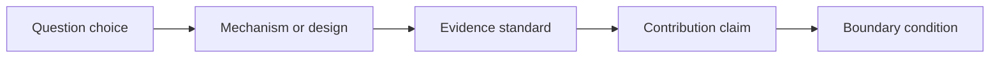

# Philippe Aghion

Philippe Aghion is read here as a source of research judgment in economics, not as a topic list. The question is what a researcher can learn from the repeated shape of the work: what kinds of puzzles become important, what mechanisms or designs carry the argument, what evidence is treated as persuasive, and how the paper keeps its contribution within honest boundaries.

The dominant taste signal on this page is visible in the following skills: Model growth as creative destruction, Link innovation incentives to competition and institutions, Use theory and empirics together to study technological change. Read them as a connected chapter. Together they describe how to move from an interesting setting to a disciplined research claim.

## Evidence Base

The page is built from representative paper anchors and public scholarly reputation, then translated into portable skills. The anchors are not decorative. They are a check against fantasy: if a skill cannot be seen across the papers, it should be downgraded or removed. A Model of Growth Through Creative Destruction Competition and Innovation: An Inverted-U Relationship Endogenous Growth Theory

| Evidence Anchor | What To Check |
|---|---|
| A Model of Growth Through Creative Destruction | Use this paper to check whether the skill appears in question choice, mechanism, evidence, or framing. |
| Competition and Innovation: An Inverted-U Relationship | Use this paper to check whether the skill appears in question choice, mechanism, evidence, or framing. |
| Endogenous Growth Theory | Use this paper to check whether the skill appears in question choice, mechanism, evidence, or framing. |

## Reading The Taste

When reading Philippe Aghion, focus first on the opening move. Ask how the paper convinces the reader that the question matters. Then look for the engine of the paper: the model, design, data construction, comparison, historical fact, market friction, institutional detail, or mechanism that does the real work. Finally, study the boundary. The strongest papers usually know what they have not proved.

## Skill: Model growth as creative destruction

Use this skill when the project has a mechanism that must be made explicit enough to generate a prediction or benchmark. The trigger should be visible before the skill is applied. If the project only shares the scholar's topic, keep reading; if it shares the same kind of research problem, the skill is relevant.

The research move is to model growth as creative destruction in a way that changes the project's decision rule. Read the evidence anchors above and ask what the scholar makes precise: the question, the mechanism or design, the evidence standard, and the boundary of the claim. Your project version should name those pieces before it borrows the move.

Practice the skill in one page. First, write the situation in which you would use "Model growth as creative destruction". Second, state the mechanism, comparison, measure, or benchmark in one sentence. Third, name the closest alternative explanation. Fourth, describe the evidence that would change a skeptical reader's mind. Fifth, write the narrowest honest contribution claim.

Feedback should be concrete. The skill is working if the before-and-after note shows a sharper question, cleaner model, better measure, more credible test, or more disciplined introduction. The skill is still immature if it only produces topic words or admiration for the scholar.

The boundary is part of the taste. This becomes bad taste when the model becomes decoration: it uses formal language but does not sharpen a prediction, benchmark, or interpretation. A strong use of the skill should make the project more ambitious and more honest at the same time.

A useful self-review prompt is: "Apply the skill 'Model growth as creative destruction' to my project. Identify the trigger, the research move, the evidence anchor, the closest alternative explanation, the feedback signal, the failure mode, and the transfer sentence."

## Skill: Link innovation incentives to competition and institutions

Use this skill when the project has a mechanism that must be made explicit enough to generate a prediction or benchmark. The trigger should be visible before the skill is applied. If the project only shares the scholar's topic, keep reading; if it shares the same kind of research problem, the skill is relevant.

The research move is to link innovation incentives to competition and institutions in a way that changes the project's decision rule. Read the evidence anchors above and ask what the scholar makes precise: the question, the mechanism or design, the evidence standard, and the boundary of the claim. Your project version should name those pieces before it borrows the move.

Practice the skill in one page. First, write the situation in which you would use "Link innovation incentives to competition and institutions". Second, state the mechanism, comparison, measure, or benchmark in one sentence. Third, name the closest alternative explanation. Fourth, describe the evidence that would change a skeptical reader's mind. Fifth, write the narrowest honest contribution claim.

Feedback should be concrete. The skill is working if the before-and-after note shows a sharper question, cleaner model, better measure, more credible test, or more disciplined introduction. The skill is still immature if it only produces topic words or admiration for the scholar.

The boundary is part of the taste. This becomes bad taste when the model becomes decoration: it uses formal language but does not sharpen a prediction, benchmark, or interpretation. A strong use of the skill should make the project more ambitious and more honest at the same time.

A useful self-review prompt is: "Apply the skill 'Link innovation incentives to competition and institutions' to my project. Identify the trigger, the research move, the evidence anchor, the closest alternative explanation, the feedback signal, the failure mode, and the transfer sentence."

## Skill: Use theory and empirics together to study technological change

Use this skill when the project has a mechanism that must be made explicit enough to generate a prediction or benchmark. The trigger should be visible before the skill is applied. If the project only shares the scholar's topic, keep reading; if it shares the same kind of research problem, the skill is relevant.

The research move is to use theory and empirics together to study technological change in a way that changes the project's decision rule. Read the evidence anchors above and ask what the scholar makes precise: the question, the mechanism or design, the evidence standard, and the boundary of the claim. Your project version should name those pieces before it borrows the move.

Practice the skill in one page. First, write the situation in which you would use "Use theory and empirics together to study technological change". Second, state the mechanism, comparison, measure, or benchmark in one sentence. Third, name the closest alternative explanation. Fourth, describe the evidence that would change a skeptical reader's mind. Fifth, write the narrowest honest contribution claim.

Feedback should be concrete. The skill is working if the before-and-after note shows a sharper question, cleaner model, better measure, more credible test, or more disciplined introduction. The skill is still immature if it only produces topic words or admiration for the scholar.

The boundary is part of the taste. This becomes bad taste when the model becomes decoration: it uses formal language but does not sharpen a prediction, benchmark, or interpretation. A strong use of the skill should make the project more ambitious and more honest at the same time.

A useful self-review prompt is: "Apply the skill 'Use theory and empirics together to study technological change' to my project. Identify the trigger, the research move, the evidence anchor, the closest alternative explanation, the feedback signal, the failure mode, and the transfer sentence."

## How To Use This Page

Use this page by choosing one skill and applying it to a live project in prose. Write the project version of the puzzle, the mechanism or design, the evidence standard, and the boundary. If the exercise only produces a slogan, return to the evidence anchors and read again. The goal is to absorb Philippe Aghion's research judgment without becoming derivative.
