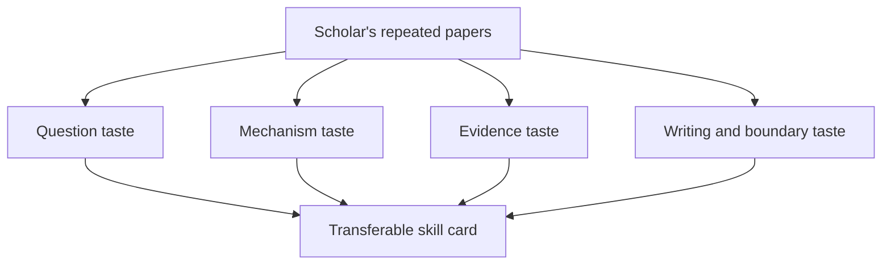

# Finance Scholars

This chapter reads finance scholars as teachers of research judgment. Each scholar page is a compact study of repeated taste: the questions the scholar makes important, the mechanisms or designs that carry the argument, the kind of evidence that receives trust, and the boundaries that keep the contribution honest.

The pages should not be read as biography. They are closer to marginal notes from reading papers. A good scholar page lets you borrow a research move without copying the topic. When the page works, you can close it and immediately revise your own project with a sharper question, cleaner mechanism, better test, or more disciplined introduction.

## Reading Guide

Start with one scholar whose field is close to your project and one whose field is distant. The nearby scholar will teach practical moves; the distant scholar will reveal whether the move is truly general. For every page, ask what the scholar repeatedly refuses to leave vague. That refusal is often the center of the taste.

## Scholar Map

| Scholar | Dominant Skill Signals | Confidence |
|---|---|---|
| [Andrei Shleifer](andrei-shleifer/) | Turn behavioral limits into market-level implications, Use legal and institutional variation to study finance and growth | high |
| [Antoinette Schoar](antoinette-schoar/) | Study household and entrepreneurial finance through decision frictions, Use microdata to reveal financial behavior heterogeneity | high |
| [Campbell Harvey](campbell-harvey/) | Study expected returns through cross-sectional and global evidence, Treat multiple testing and p-hacking as central finance problems | high |
| [Darrell Duffie](darrell-duffie/) | Use institutional detail to model over-the-counter markets, Translate market plumbing into asset pricing and policy implications | medium |
| [Douglas Diamond](douglas-diamond/) | Model banks as liquidity and monitoring institutions, Treat financial fragility as a structural feature of banking | medium |
| [Eugene Fama](eugene-fama/) | Treat prices as disciplined summaries of information, Convert market efficiency into testable implications | medium |
| [Fischer Black](fischer-black/) | Turn pricing problems into replication arguments, Use arbitrage logic to derive valuation formulas | low |
| [Franco Modigliani](franco-modigliani/) | Use irrelevance benchmarks to discipline corporate finance, Build clean theoretical baselines before adding frictions | low |
| [Harrison Hong](harrison-hong/) | Study disagreement, constraints, and market mispricing, Use social interaction and attention as finance mechanisms | medium |
| [Hélène Rey](helene-rey/) | Treat global financial cycles as constraints on national policy, Connect capital flows, exchange rates, and risk appetite | high |
| [Jeremy Stein](jeremy-stein/) | Link corporate finance frictions to macro-financial outcomes, Use simple models to connect financial constraints and behavior | medium |
| [John Campbell](john-campbell/) | Decompose asset prices into interpretable economic components, Connect household finance decisions to asset pricing and welfare | medium |
| [John Cochrane](john-cochrane/) | Use asset pricing theory as a unifying language, Translate discount rates into economic mechanisms | high |
| [Kenneth French](kenneth-french/) | Turn factor construction into reusable research infrastructure, Use portfolio sorts to reveal systematic return patterns | high |
| [Lars Peter Hansen](lars-peter-hansen/) | Use moment restrictions to discipline economic models, Treat uncertainty and robustness as research objects | medium |
| [Luigi Zingales](luigi-zingales/) | Connect corporate finance to institutions and politics, Use cross-country variation to study financial development | high |
| [Markus Brunnermeier](markus-brunnermeier/) | Model financial fragility as endogenous amplification, Treat liquidity and leverage as dynamic state variables | high |
| [Merton Miller](merton-miller/) | Use frictionless benchmarks to identify which frictions matter, Build corporate finance theory from clean arbitrage arguments | low |
| [Michael Jensen](michael-jensen/) | Turn agency conflicts into corporate finance questions, Use governance failures to explain firm behavior | medium |
| [Myron Scholes](myron-scholes/) | Convert derivative pricing into a no-arbitrage design, Use continuous-time reasoning to simplify valuation | low |
| [Philip Dybvig](philip-dybvig/) | Build minimal models of coordination failure, Explain banking crises through liquidity insurance and strategic behavior | low |
| [Raghuram Rajan](raghuram-rajan/) | Connect financial development to real economic outcomes, Treat banks and intermediaries as macro-relevant institutions | high |
| [Robert Engle](robert-engle/) | Model volatility as a dynamic economic object, Build econometric tools from observed market behavior | medium |
| [Robert Merton](robert-merton/) | Use continuous-time models to organize finance problems, Turn dynamic optimization into asset-pricing intuition | medium |
| [Robert Shiller](robert-shiller/) | Use prices to test narratives, expectations, and excess volatility, Connect behavioral finance to macro-financial history | high |
| [Stewart Myers](stewart-myers/) | Explain corporate financing through information and investment frictions, Use pecking order logic to organize financing behavior | low |
| [Ulrike Malmendier](ulrike-malmendier/) | Turn life experience into an economic state variable, Measure behavioral biases in corporate and household decisions | high |
| [Viral Acharya](viral-acharya/) | Measure systemic risk through bank behavior and market signals, Connect credit frictions to macroeconomic outcomes | high |
