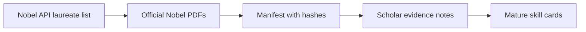

# Nobel Skill Map

This map is an evidence-status page for Nobel-linked research taste work. It should be read after the main Nobel chapter page. The purpose is to keep the scholar-skill pipeline honest: first collect legal evidence, then infer recurring research moves, then write mature skill cards.

The current local cache contains 91 official NobelPrize.org PDFs covering 1969 through 2025. The cache includes 59 prize lecture PDFs, 19 lecture slide PDFs, 7 advanced scientific background PDFs, and 6 popular background PDFs. The PDFs are stored locally and ignored by Git; the tracked manifest is `00-start-here/_support/evidence/nobel-open-access/download_manifest.json`.

| Evidence Layer | What It Gives | Current Status | Next Use |
|---|---|---|---|
| Prize lecture PDFs | The laureate's own account of the contribution and research path | downloaded where direct official PDFs were found | extract question choice, mechanism, and boundary |
| Lecture slide PDFs | Compact diagrams, models, and empirical summaries for recent laureates | downloaded where direct official slide PDFs were found | identify teachable research moves |
| Advanced background PDFs | Nobel committee synthesis and bibliography | downloaded for available recent years | choose canonical papers for selective open-access download |
| Popular background PDFs | Nontechnical contribution summary | downloaded for available recent years | write accessible chapter framing |
| Canonical journal papers | The actual research designs, models, and evidence | not bulk-downloaded | collect only legal author-hosted or working-paper versions |

## Boundary

Do not treat the Nobel cache as a complete literature archive. It is an evidence foundation for taste extraction. The next pass should use the advanced background bibliographies to choose a small set of canonical papers per laureate, then download only legal open-access versions.
