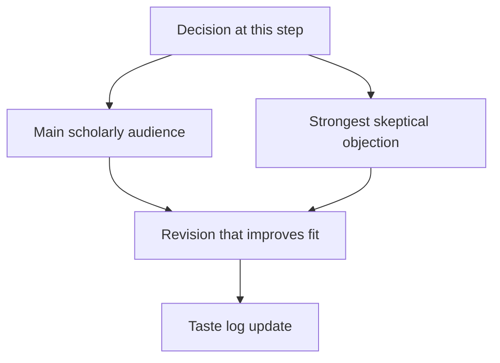

# Step: Building Theory

This page treats building theory as a research-taste decision rather than an administrative task. At this stage, the researcher is deciding what kind of paper the project can become. A weak decision here will echo through the rest of the project: the theory may become decorative, the data may answer the wrong question, the identification may be asked to carry too much, or the writing may promise more than the design can support.

Good taste at this step means making the decision explicit. You should be able to state what is being chosen, why the choice fits the research question, what a skeptical reader would doubt, and what the next step should learn from this one. The best researchers do not treat the workflow as a sequence of boxes to tick. They treat each step as a chance to sharpen the paper.

## How To Work Through This Step

Write one paragraph naming the decision. Write a second paragraph explaining why the decision is attractive. Write a third paragraph against yourself, as if you were the most skeptical referee. Then write the revision you would make if the skeptical paragraph were true. The discipline is to keep the project moving while refusing to hide the weakness.

## Before Moving On

Before leaving this step, make sure the choice improves the contribution rather than only making the paper look more complete. The next step should be clearer because of what you learned here. If the next step is not clearer, the current step has probably produced description rather than research taste.
