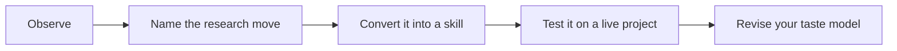

# 05 - Tastes By Research Step

This chapter converts the taste model into a research workflow. A project does not fail only at the end. It can fail when the idea is chosen, when the question is formed, when the theory is made too decorative, when the measure drifts away from the concept, or when the revision answers the wrong objection.

Use this chapter while working on a live project. At each step, pause long enough to state the decision being made, the strongest skeptical objection, the scholar or journal taste that should discipline the choice, and the next concrete revision.

## How This Chapter Should Be Read

Read the chapter in paragraphs, not as a checklist. The headings are navigation aids, but the substance is the judgment behind them. When you finish a page, you should be able to say: this is the research choice being discussed, this is what good taste looks like, this is what bad taste looks like, and this is how I would apply the lesson to one of my own projects.

## Working Rule

A taste principle is only useful when it changes a decision. If a page gives you a pleasing phrase but no change in question, design, measure, mechanism, writing, or revision strategy, keep reading until you can turn the idea into an action.
