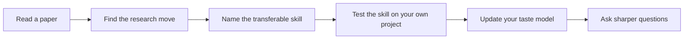
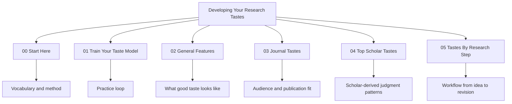

# Developing Your Research Tastes

This repository is written as a small open book about research taste in economics and finance. It is meant to be read from chapter `00` through chapter `05`, not browsed as a pile of folders. The central claim is simple: research taste is not a mysterious personality trait. It is a trainable judgment system that helps a scholar decide which questions matter, which mechanisms are worth modeling, which evidence should be trusted, and which contribution claims are honest.

The book treats papers, scholars, journals, and research steps as evidence about judgment. A good paper is not only a finished product; it is a record of choices. The author chose a question instead of many alternatives, selected a setting, made a measurement decision, committed to an identification or modeling strategy, wrote the introduction in a particular order, and decided how far the conclusion should travel. Reading for taste means recovering those choices and turning them into reusable habits.



## How To Read The Book

Begin with `00-start-here`, which explains the vocabulary and the reading method. Then move to `01-train-your-taste-model`, where the repo becomes a practical training system. Chapter `02` explains the general features of good research taste: question choice, theory, data, measurement, identification, mechanism, contribution, writing, and anti-skills. Chapter `03` compares journal taste environments, because the same paper can be too narrow for one journal and too under-identified for another. Chapter `04` reads top scholars as patterns of judgment rather than as celebrities. Chapter `05` turns the whole system into a research workflow, from idea generation to revision.

The visible folders are intentionally limited to these chapters. Supporting material, scripts, templates, data, and old indexes have been folded into `00-start-here/_support/` so readers do not have to decide whether to open them. If you are reading the book, ignore `_support`. If you are maintaining the repo, it is there.

## What Counts As A Skill

A skill in this repo is not a slogan. It has to be portable, useful under pressure, and bounded. “Study institutions” is not a skill. “Turn an institutional difference into a mechanism and then ask what evidence would distinguish it from a competing mechanism” is a skill. The second version tells a researcher what to do, how to test whether the move worked, and when the move might become bad taste.

The same standard applies to scholar pages. A scholar page should not say that a scholar is “interested in labor” or “known for asset pricing.” It should explain the repeated research move: how the scholar compresses a question, builds a design or model, reads evidence, handles scope, and teaches the reader what changed.

## Visual Map Of The Repository



## Evidence Standard

The current scholar pages are written as reviewed draft chapters: they use well-known paper anchors and public scholarly reputations, but they should still be tightened over time with direct paper links, author pages, Nobel materials, journal pages, and uploaded PDFs. The standard for future upgrades is not “more text.” It is better evidence: exact papers, exact mechanisms, exact boundary conditions, and clearer warnings about when a skill should not be copied.

## Local Extraction Tool

The repo includes a local extractor for turning a folder of PDFs into a generated scholar README. It is a maintenance tool, not part of the reading path. Install it with `bash 00-start-here/_support/scripts/install.sh core`, then place PDFs under `00-start-here/_support/data/raw/jane-doe/` and run:

```bash
python 00-start-here/_support/scripts/extract_scholar_taste.py \
  --scholar-name "Jane Doe" \
  --input-dir 00-start-here/_support/data/raw/jane-doe \
  --processed-root 00-start-here/_support/data/processed \
  --scholar-root 04-top-scholar-research-tastes/local-generated
```

The tool is rule-first and auditable: it looks for repeated gap framing, aim language, method language, credibility checks, and scope boundaries rather than inferring taste from topic words alone.
